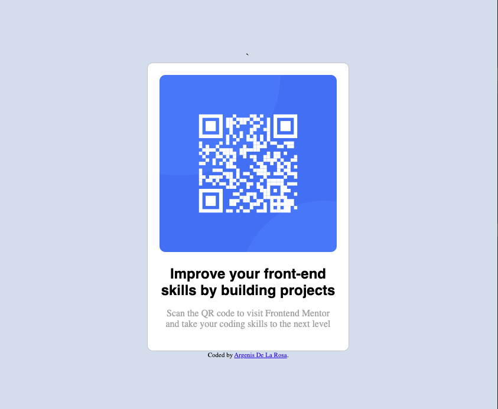

## Table of contents

- [Overview](#overview)
  - [Screenshot](#screenshot)
  - [Links](#links)
- [My process](#my-process)
  - [Built with](#built-with)
  - [What I learned](#what-i-learned)
  - [Continued development](#continued-development)
  - [Useful resources](#useful-resources)
- [Author](#author)
- [Acknowledgments](#acknowledgments)

## Overview

### Screenshot

### Links

- Solution URL: [Add solution URL here](https://github.com/theonlyhennygod/qr-code)
- Live Site URL: [Add live site URL here](https://theonlyhennygod.github.io/qr-code/)

### Built with

- Semantic HTML5 markup
- CSS custom properties
- Flexbox
- Mobile-first workflow

### What I learned

I learned how to build more responsive sites using the bem technique and building a simple site like this from raw HTML / CSS.

## Author

- Website - [Argenis De La Rosa](https://www.your-site.com)
- Frontend Mentor - [@theonlyhennygod](https://www.frontendmentor.io/profile/theonlyhennygod)
- Twitter - [@argenistherose](https://www.twitter.com/argenistherose)
